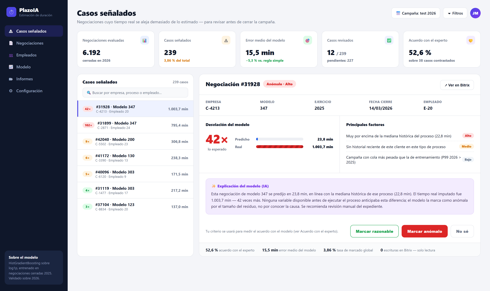

# Entrega 5 — Diseño del frontal y experiencia de usuario

## 1. Resumen de la solución y del usuario

El proyecto estima cuántos minutos llevará un proceso de asesoría (modelo tributario) antes de
ejecutarlo, y usa ese mismo modelo, al cerrar cada campaña, para señalar las negociaciones cuyo
tiempo real se ha alejado demasiado de lo esperado. El frontal de esta entrega es la segunda mitad:
el **panel de revisión de casos señalados**.

- **Problema que resuelve**: al cerrar una campaña (p. ej. los 303 del trimestre), nadie revisa a
  mano las miles de negociaciones cerradas para ver cuáles se han disparado en tiempo. El trabajo
  atípico pasa desapercibido salvo que alguien tropiece con él.
- **Usuario principal**: un gestor o responsable de equipo de la asesoría, no el asesor que ejecutó
  el proceso. Es quien cierra la campaña y decide qué merece revisión.
- **Necesidad concreta**: reducir miles de negociaciones a una lista corta y manejable de casos que
  sí vale la pena mirar, con el contexto necesario para juzgar cada uno sin abrir Bitrix caso por
  caso.
- **Tipo de producto**: un híbrido de dashboard analítico y herramienta de revisión — no es un
  clasificador que decide solo, es un explorador que prioriza y explica, y deja la decisión final
  (razonable / anómalo / no sé) en manos del gestor.
- **Resultado principal**: de las 6.192 negociaciones cerradas en el periodo de prueba, el panel
  reduce la revisión a las 239 señaladas (3,86 %) y da, por cada una, un veredicto humano que
  alimenta el contraste de acuerdo con el modelo.

## 2. Imagen mockup del frontal

La imagen representa la pantalla principal: lista de casos señalados a la izquierda, panel de
detalle del caso seleccionado a la derecha, con la predicción, el resultado real, los factores que
explican la marca y las tres acciones de revisión.

## 3. Justificación del diseño

### 3.1 Utilidad y valor de la solución

- **Qué tarea resuelve**: convierte "revisar 6.192 negociaciones" en "revisar 239", un volumen que
  una persona puede recorrer en una sesión de trabajo — es el mismo criterio de corte que fija la
  Fase 6 del proyecto (por debajo del 5 % de marcado, la revisión es manejable en la práctica).
- **Qué decisión mejora / qué riesgo reduce**: reduce el riesgo de que un sobrecoste de tiempo real
  (posible incidencia, cliente más complejo de lo habitual, o trabajo mal registrado) pase
  inadvertido hasta la siguiente campaña. No mejora ni pretende mejorar la facturación ni evaluar a
  las personas — esa distinción se hace explícita en el propio panel.
- **Qué información es esencial y cuál se decide no mostrar**: se muestra el proceso, la desviación,
  los minutos predichos/reales y los factores que la explican. **No se muestra el nombre de la
  empresa ni del empleado, solo un código** (`C-4213`, `E-20`) — es la misma regla de anonimización
  que exige la memoria del proyecto (Fase 0.4 de `GUIA_AGENTE.md`). Tampoco se muestra ningún
  ranking de empleados por número de casos señalados: mostrarlo invitaría a leer el panel como una
  evaluación de personas, que es justo lo que la limitación 6 de la memoria prohíbe.
- **Cómo se convierte el resultado en una acción útil**: cada caso termina en un veredicto explícito
  del gestor (razonable / anómalo / no sé), no en una alerta pasiva. Ese veredicto es la misma
  mecánica que ya se usó para la validación ciega con el experto (Fase 6, acuerdo real del 52,6 %
  sobre 38 casos) — el panel la convierte en un flujo continuo en vez de un ejercicio puntual.

### 3.2 Flujo de usuario

1. **Punto de entrada**: el gestor abre el panel al cerrar una campaña y ve de un vistazo los cinco
   indicadores clave: negociaciones evaluadas, casos señalados, error medio del modelo, casos ya
   revisados y el acuerdo histórico con el criterio experto (para saber cuánto fiarse del panel
   antes de usarlo).
2. **Entradas/selecciones**: filtra por campaña, busca por empresa/proceso/empleado, y selecciona un
   caso de la lista ordenada por severidad (el multiplicador "veces lo esperado").
3. **Procesamiento** (no visible en pantalla): el modelo HistGradientBoosting sobre `log1p` calcula
   la predicción; el residuo se estandariza por la sigma histórica de ese proceso; si el residuo
   supera z=3 se marca. El texto de "Explicación del modelo" se rellena con esas mismas cifras, no
   se genera libremente (ver 4).
4. **Resultado**: panel de detalle con la comparación predicho/real, los tres factores principales y
   la explicación en lenguaje llano.
5. **Acción**: marcar un veredicto o abrir el expediente real en Bitrix para más contexto.
6. **Excepciones**:
   - Si el cliente o el proceso no tienen historial suficiente, el factor correspondiente se muestra
     como *"sin datos suficientes de este cliente en este proceso"* en vez de omitirse en silencio.
   - Si un proceso tiene menos de 20 casos en train, la sigma usada es la global del pipeline, y el
     panel lo indica junto al factor de desviación.
   - Si una campaña no tiene casos señalados, la lista muestra un estado vacío ("sin casos que
     revisar en esta campaña") en vez de una lista en blanco sin explicación.

### 3.3 Experiencia de usuario

- **Jerarquía visual**: los indicadores de contexto van arriba (qué tan grande es el problema hoy),
  la lista prioriza a la izquierda (qué mirar primero, ordenada por severidad) y el detalle explica
  a la derecha (por qué). Nada compite por la atención al mismo nivel.
- **Simplicidad**: no aparecen hiperparámetros del modelo, ni el valor de sigma, ni la fórmula del
  z-score en la pantalla principal — esa información técnica vive en la memoria del proyecto
  (Entrega 4), no en el frontal.
- **Legibilidad y consistencia**: un único código de color con significado fijo en toda la pantalla
  — rojo/alto, ámbar/medio, verde/bajo — y las cifras siempre en minutos, nunca en escala
  logarítmica (que es como internamente trabaja el modelo, pero no significa nada para un gestor).
- **Contexto y confianza**: el panel no se presenta como un oráculo. La barra inferior muestra el
  52,6 % de acuerdo real con el criterio experto — una cifra modesta, mostrada tal cual, para que el
  gestor calibre cuánto confiar antes de usarlo a ciegas.
- **Control del usuario**: el modelo señala, la persona decide. El veredicto final es siempre del
  gestor, y el panel dice explícitamente "0 escrituras en Bitrix — solo lectura": nada se modifica
  automáticamente en el CRM.
- **Feedback del sistema**: contador de pendientes ("12 / 239"), badge de severidad por caso, y la
  franja de confianza al pie de cada detalle.
- **Accesibilidad y dispositivo**: pensado para escritorio, en el puesto del gestor al cerrar la
  campaña. No se ha optimizado para móvil en este MVP — no es un caso de uso mientras se está fuera
  de oficina.

## 4. Presentación de resultados y explicabilidad

- **Resultado principal**: una marca binaria (razonable / anómalo) por residuo estandarizado, con un
  multiplicador entendible ("42× lo esperado") como score, en vez de exponer directamente el
  z-score.
- **Información adicional para interpretarlo**: la mediana histórica del proceso como referencia, la
  comparación directa predicho/real en minutos, y los tres factores con mayor peso en la predicción
  de ese caso concreto (traducidos a lenguaje llano a partir de la importancia por permutación de la
  Fase 5).
- **Cómo se evita presentar una estimación como certeza**: el texto de explicación dice literalmente
  que el modelo marca el caso *"por el tamaño del residuo, no por conocer la causa"*, y la franja de
  confianza muestra el 52,6 % de acuerdo con el experto en vez de sugerir que el modelo siempre
  acierta.
- **Qué se reserva para la memoria y no aparece aquí**: hiperparámetros, la definición matemática del
  z-score, el procedimiento de `GroupKFold` y el detalle de las features — todo eso vive en la
  Entrega 4, no en el frontal.

### IA generativa como capa de explicación

Sí se usa: el bloque **"Explicación del modelo (IA)"** genera una frase por caso. Es importante ser
preciso sobre qué hace y qué no hace, porque el enunciado lo exige explícitamente:

- La explicación se construye con una **plantilla determinista rellenada con datos ya calculados**
  del propio caso (proceso, minutos predichos, minutos reales, mediana histórica del proceso,
  multiplicador). No hay ningún paso en el que un modelo de lenguaje decida qué causa atribuir al
  caso — eso lo decidiría siempre el gestor.
- Si en el futuro se sustituye la plantilla por un LLM, su única función sería dar fluidez de
  redacción a esos mismos números, nunca inventar factores nuevos ni sustituir el cálculo del
  residuo. Esta distinción es la que pide el enunciado ("no debe inventar causas ni sustituir al
  modelo analítico") y es coherente con la regla de todo el proyecto: ninguna afirmación sin un
  número detrás.
- Su uso aquí no es imprescindible para que el panel funcione — el mismo contenido podría mostrarse
  como una lista de factores sin prosa. Se incluye porque, para un gestor que revisa muchos casos
  seguidos, una frase se lee más rápido que una tabla.

## 5. Alcance del MVP

**Lo que ya está implementado y validado**, fuera del frontal: el modelo de planificación
(`HistGradientBoostingRegressor`), la regla de anomalías y su validación contra un experto (acuerdo
52,6 % sobre 38 casos, Fase 6), y los scripts reproducibles en `src/` que generan todos los números
que aparecen en esta pantalla.

**Lo que es solo representación visual en esta entrega**: la interfaz completa (barra lateral,
lista, panel de detalle) es una maqueta estática — no hay backend ni base de datos detrás de esta
imagen concreta. La búsqueda, los filtros y los botones de veredicto no están conectados a nada
todavía.

**Tecnología prevista para la versión real**: el resto de herramientas internas de la asesoría
(gestión de tiempos y CRM) ya están construidas en PHP plano sobre MySQL, sin framework. La versión
funcional de este panel se integraría como una pestaña más de esa aplicación existente, reutilizando
sus componentes reales (tablas, tarjetas, badges de estado) en vez del lenguaje visual más
"producto SaaS" de esta maqueta — esta entrega usa un estilo más elaborado a propósito, para que la
propuesta se entienda de forma autónoma sin depender del contexto interno de la asesoría.

**Qué queda fuera, con intención**: no incluye edición de datos en Bitrix (el acceso es de solo
lectura, por diseño y por seguridad), no incluye una vista móvil, y no incluye gestión de roles o
usuarios múltiples — el MVP se dirige a un único perfil (el gestor que cierra la campaña), no a una
plataforma multiusuario.
